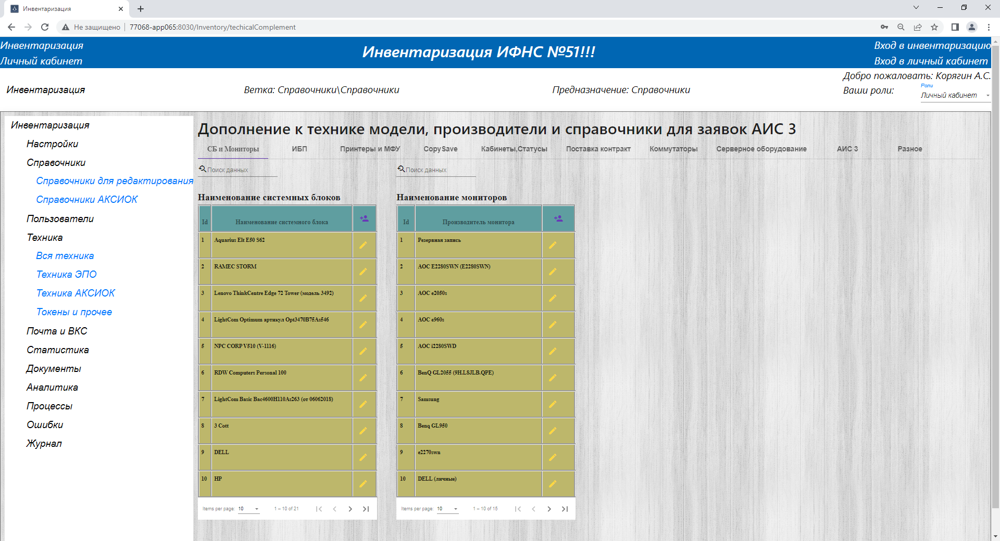
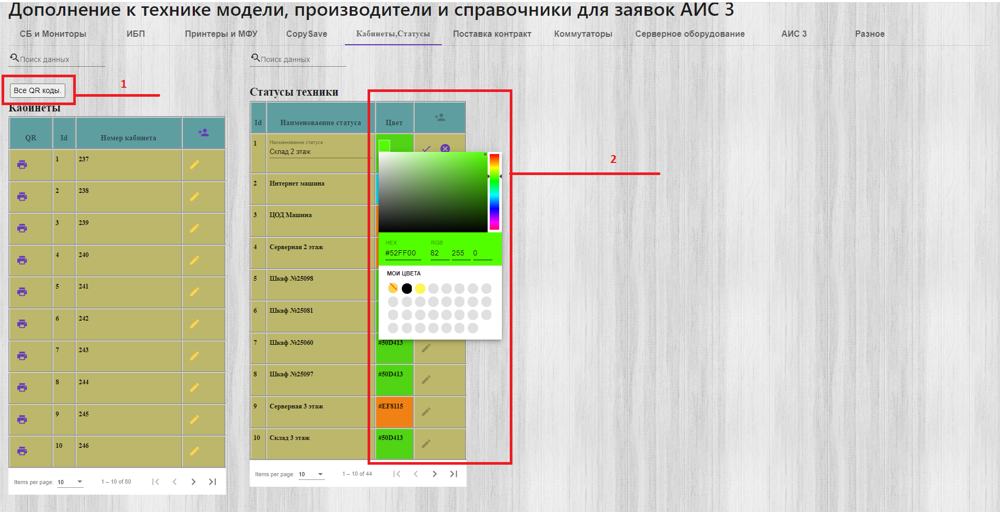
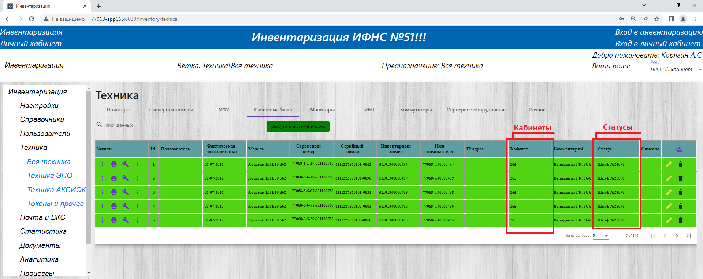
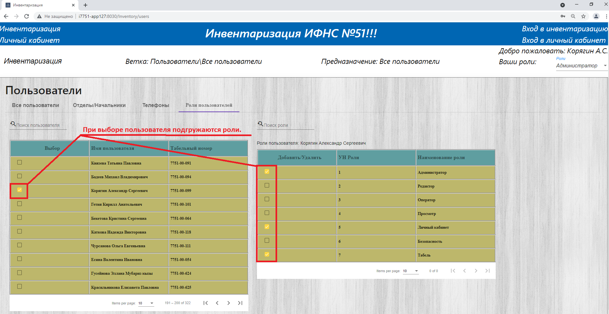
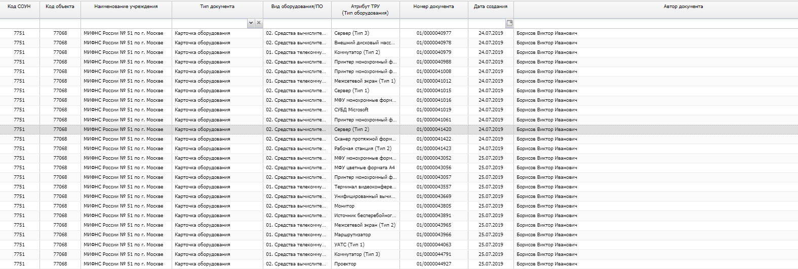
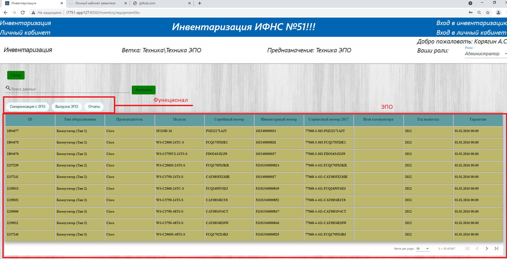

<br>
<br>
<br>
<br>
<br>
<br>
<br>
<br>
<br>
<br>
<br>
<br>
<br>
<br>
<br>
<center><h1><p style="text-align: center;">Инструкция пользователя по программе Автоматизированная информационная система инвентаризации ("АИСИ")</p></h1></center>

<div class="page"/>

<center><h1>Оглавление</h1></center>

1. <a href="#history">История создания</a>
2. <a href="#function">Реализованные функции</a>
3. <a href="#ui">Интерфейс общего пользования</a>
4. <a href="#inventory">Инвентаризация</a>
    1. <a href="#setting">Настройки</a>
       1. <a href="#settingPublic">Общие настройки</a>
       2. <a href="#settingHoliday">Справочник праздничных дней</a>
       3. <a href="#settingRu">Настройка падежей отделов</a>
       4. <a href="#regal">Настройка регламентов</a>
       5. <a href="#settingTelephon">Настройка категории телефонов</a>
    2. <a href="#directory">Справочники</a>
       1. <a href="#directory">Справочники для редактирования наименований</a>
          * <a href="#publicDirectory">Общее представление о справочниках</a>
          * <a href="#sbAndMonitor">Сис. Блоки и Мониторы</a>
          * <a href="#ibp">ИБП</a>
          * <a href="#printers">Принтеры и МФУ</a>
          * <a href="#copySave">Справочник терминалов контроля копирования</a>
          * <a href="#status">Кабинеты и статусы</a>
          * <a href="#contract">Поставка контракт</a>
          * <a href="#commutators">Коммутаторы</a>
          * <a href="#server">Серверное оборудование</a>
          * <a href="#journal">Журналы</a>
          * <a href="#other">Разное</a>
       2. <a href="#directoryAksiok">Справочники АКСИОК</a>
          * <a href="#allModelAksiok">Все модели и типа в Аксиок</a>
    3. <a href="#users">Пользователи</a>
       1. <a href="#usersAll">Все пользователи</a>
          * <a href="#usersAll1">Все пользователи</a>
          * <a href="#department">Отделы/Начальники</a>
          * <a href="#telephone">Телефоны</a>
          * <a href="#rule">Роли пользователей</a>
       2. <a href="#treeAis3">Ветки АИС 3</a>
       3. <a href="#treeAis3AndUsers">Анализ ролей и шаблонов</a>
       4. <a href="#journalAis3">Журнал для заявок</a>
       5. <a href="#discrepancyDataBase">Разночтение БД</a>
          * <a href="#UserDataBase">Разночтения данных пользовательских</a>
          * <a href="#TechnicsDataBase">Разночтения данных техники</a>
       6. <a href="#fileServer">Файловый сервер</a>
    4. <a href="#technics">Техника</a>
       1. <a href="#technics">Вся техника</a>
       2. <a href="#technicsEpo">Техника ЭПО</a>
       3. <a href="#technicsAksiok">Техника АКСИОК</a>
       4. <a href="#technicsToken">Токены и прочее</a>
    5. <a href="#mail">Почта и ВКС</a>
       1. <a href="#mail">Письма Nalog и ВКС</a>
       2. <a href="#userGroup">Пользователи и группы</a>
    6. <a href="#statistic">Статистика</a>
    7. <a href="#allDoc">Документы</a>
       1. <a href="#docN">Накладные на внутреннее перемещение</a>
       2. <a href="#docBook">Книги учета</a>
    8. <a href="#analytic">Аналитика</a>
        1. <a href="#noneUser">Отсутствие техники у пользователя (View).</a>
        2. <a href="#analyticSb">Аналитика мониторы и Системные блоки  (View).</a>
    9. <a href="#process">Процессы</a>
       1. <a href="#parameterProcess">Процессы и параметры</a>
       2. <a href="#processAll">Синхронизация</a>
    10. <a href="#error">Ошибки</a>
    11. <a href="#journalEdit">Журнал изменений</a>
5. <a href="#lk">Личный кабинет</a>
6. <a href="#planEnd">Дальнейшие планы и развития продукта.</a>
7. <a href="#end">Заключение</a>

<div class="page"/>

<center><h1 id="history">1 История создания</h1></center>
&nbsp;&nbsp;&nbsp;&nbsp;&nbsp;История создания программы уходит в далекий 2018 год, а именно, когда понадобилась система автоматизации при работе с инвентаризацией.<br>

> <h3 style="color:red" >P.S.: Все скриншоты работы программы приведены на примере ИФНС 51<h3>

<h3 id="problem" style="font-weight:bold">Причины появление продукта:</h3>

1. <p><a href="#1">Трудное ведение реестров по техники в Excel.</a></p>
2. <p id="2">Отсутствие статистики и аналитики.</p>
3. <p id="3">Постоянная актуализация телефонного справочника Инспекции.</p>
4. <p id="4">Отсутствие автоматизации с системой ДКС (Должность, Отдел и т.п.).</p>
5. <p><a href="#5">Сложность создания заявок с порталом ФКУ "НАЛОГ-СЕРВИС" ФНС России (далее - СТП). Много полей для ввода.</a></p>
6. <p><a href="#6">Отсутствие автоматизации в Электронном паспорте оборудования (далее - ЭПО).</a></p>
7. <p id="7">Графики ВКС. Отсутствие синхронизации с почтовым ящиком ИТ.</p>
8. <p id="8">Отсутствие автоматизации накладной на внутреннее перемещение.</p>
9. <p id="9">Отсутствие автоматизации Книг учета материальных ценностей.</p>
10. <p><a href="#10">Отсутствие истории изменений.</a></p>
11. <p><a href="#11">Отсутствие автоматизации в Автоматизированной комплексной системе исполнения сметы органов казначейства (далее - АКСИОК).</a></p>

> Сразу дополню в процессе автоматизации выше перечисленных проблем родилось несколько идей, которые в последствии реализовались.<br>

<h3 id="problemUse" style="font-weight:bold">Реализованные идеи:</h3>

1. <a href="#p1">Синхронизация с Active Directory (Компьютеры).</a>
2. <a href="#p1">Синхронизация с PrintServer (Принтеры).</a>
3. <a href="#p2">Анализ ошибок в системе (Серийный номер, Инвентарный номер и т.п.).</a>
4. QR-код оборудования и кабинета.
5. <a href="#p4">Личный кабинет пользователя.</a>
6. Автоматическое формирование служебных записок.
7. Автоматическое формирование табеля на отдел.
8. Автоматический опрос серверов на доступность с отчетом Excel.
9. Анализ данных на разночтение DKS, Active Directory, Lotus, АИСИ (в рамках Пользователя).
10. Анализ данных разночтения АИСИ, Active Directory, АКСИОК (в рамках Техники).
11. Анализ и индексация файлового сервера.
12. Упрощённая работа с АКСИОК (в рамках редактирования и добавления).
13. Подгруздка данных с сервера касперского (для АИСИ).

<h3 style="font-weight:bold">Идеи, которые заслуживают внимания и разработки:</h3>

1. Приложение для сканирования QR-кодов посредством создания xml.
2. Мониторинг коммутационного оборудования.
3. Синхронизация с телефонией для мониторинга.
4. Синхронизация с 1С:Предприятия.
5. Автоматическое построение карты и мониторинга сетей по протоколу SNMP.
6. Мониторинг ИБП.

> Более подробно о реализации функций автоматизации см. в разделе <a href="#function">'Реализованные функции'</a>
<div class="page"/>

<center><h1 id="function">2 Реализованные функции</h1></center>

1. Настройки
    * <a href="#setting">Инвентаризация/Настройки/Настройки приложения</a>
2. Справочники
    * <a href="#directory">Инвентаризация/Справочники/Справочники для редактирования</a>
    * <a href="#directoryAksiok">Инвентаризация/Справочники/Справочники АКСИОК</a>
3. Пользователи
    * <a href="#users">Инвентаризация/Пользователи/Все пользователи</a>
    * <a href="#treeAis3">Инвентаризация/Пользователи/Ветки АИС 3</a>
    * <a href="#treeAis3AndUsers">Инвентаризация/Пользователи/Анализ ролей и шаблонов</a>
    * <a href="#journalAis3">Инвентаризация/Пользователи/Журнал для заявок</a>
    * <a href="#discrepancyDataBase">Инвентаризация/Пользователи/Разночтение БД</a>
    * <a href="#fileServer">Инвентаризация/Пользователи/Файловый сервер</a>
4. Техника
    * <a href="#technics">Инвентаризация/Техника/Вся техника</a>
    * <a href="#technicsEpo">Инвентаризация/Техника/Техника ЭПО</a>
    * <a href="#technicsAksiok">Инвентаризация/Техника/Техника АКСИОК</a>
    * <a href="#technicsToken">Инвентаризация/Техника/Токены и прочее</a>
5. Почта и ВКС
    * <a href="#mail">Инвентаризация/Почта и ВКС/Письма Nalog и ВКС</a>
    * <a href="#userGroup">Инвентаризация/Почта и ВКС/Пользователи и группы</a>
6. Статистика
    * <a href="#statistic">Инвентаризация/Статистика/Статистика</a>
7. Документы
    * <a href="#docN">Инвентаризация/Документы/Накладные</a>
    * <a href="#docBook">Инвентаризация/Документы/Книги учета</a>
8. Аналитика
    * <a href="#analytic">Инвентаризация/Аналитика/Аналитика</a>
9. Процессы
    * <a href="#parameterProcess">Инвентаризация/Процессы/Процессы и параметры</a>
    * <a href="#processAll">Инвентаризация/Процессы/Синхронизация</a>
10. Ошибки
    * <a href="#error">Инвентаризация/Ошибки/Ошибки</a>
11. Журнал
    * <a href="#journalEdit">Инвентаризация/Журнал/Журнал изменений</a>

<div class="page"/>

<center><h1 id="inventory">3 Интерфейс общего пользования</h1></center>
&nbsp;&nbsp;&nbsp;&nbsp;&nbsp;Форма входа в Инвентаризацию:<br>
    

&nbsp;&nbsp;&nbsp;&nbsp;&nbsp;На скриншоте отмечены цифрами важные ссылки:<br>

1. Инвентаризация  
   > <h3 style="color:red" >!ВАЖНО! Если пользователь не авторизован, то программа направит его на вкладку авторизации<h3>
2. Личный кабинет
   > <h3 style="color:red" >!ВАЖНО! Если пользователь не авторизован, то программа направит его на вкладку авторизации ЛК<h3>
3. Вход в инвентаризацию
4. Вход в личный кабинет

&nbsp;&nbsp;&nbsp;&nbsp;&nbsp;После успешной авторизации в "АИСИ" пользователь попадает на Главную страницу:<br>
    

&nbsp;&nbsp;&nbsp;&nbsp;&nbsp;На главной странице отмечены важные области:<br>

1. Кнопка раскрытия\закрытия панели задач
2. Панель задач
3. Область смена фреймов (страниц)
4. Список доступных ролей пользователя

<div class="page"/>

<center><h1 id="inventory">4 Инвентаризация</h1></center>
<center><h1 id="setting">4.1 Настройки</h1></center>
&nbsp;&nbsp;&nbsp;&nbsp;&nbsp;Общие настройки программы для документов и параметров:<br>
    

&nbsp;&nbsp;&nbsp;&nbsp;&nbsp;На слайде цифрами отмечены вкладки для переключения настроек:<br>

1. Общие настройки
2. Справочник праздничных дней
3. Настройки падежей отделов
4. Настройки регламентов
5. Настройка категории телефонов (Для справочника)

<div class="page"/>

<center><h1 id="settingPublic">4.1.1 Общие настройки</h1></center>
&nbsp;&nbsp;&nbsp;&nbsp;&nbsp;В общих настройках редактируются следующие параметры:<br>


> Общие настройки очень важны для документооборота например: накладные, табеля справочник телефонов, заявки и т. д.

<div class="page"/>

<center><h1 id="settingHoliday">4.1.2 Справочник праздничных дней</h1></center>
&nbsp;&nbsp;&nbsp;&nbsp;&nbsp;Справочник праздничных и предпраздничных дней, который используется для формирования табеля отдела:


> <p id="edit"> P.S. В дальнейшем весь описанный функционал будет равноценен и к другим таблицам для редактирования

&nbsp;&nbsp;&nbsp;&nbsp;&nbsp;На слайде изображена таблица праздничных дней и доступных действий с ней:<br>

1. Строка поиска по таблице
2. Интерфейс редактирования таблиц
3. Добавление новой записи
4. Функции Редактировать/Удалить
5. Перелистывание строк в таблице

&nbsp;&nbsp;&nbsp;&nbsp;&nbsp;При нажатии на кнопку редактирования происходит блокировка остальных записей, пример на скриншоте ниже:


&nbsp;&nbsp;&nbsp;&nbsp;&nbsp;Цифрами 1 и 2 показано какие поля подвергаются редактированию. Под цифрой 3 раскрылся новый функционал:</br>

1. Галочка - действие Сохранить.
2. Крестик - действие Отменить.

> <h3 style="color:red">Обратите внимание, что добавить новую запись в режиме редактирования не представляется возможно.</h3>

<div class="page"/>

<center><h1 id="settingRu">4.1.3 Настройка падежей отделов</h1></center>
&nbsp;&nbsp;&nbsp;&nbsp;&nbsp;Справочник предназначен для редактирования падежей наименований отделов для различных параметров документооборота.


<div class="page"/>

<center><h1 id="regal">4.1.4 Настройка регламентов</h1></center>
&nbsp;&nbsp;&nbsp;&nbsp;&nbsp;Вкладка настройки регламентов отдела необходимо для формирования заявок, например для "ПК СЭОД".</br>
&nbsp;&nbsp;&nbsp;&nbsp;&nbsp;Содержит краткую выдержку из должностного регламента сотрудника отдела.

Образец заявки ПК СЭОД:


<div class="page"/>

<center><h1 id="settingTelephon">4.1.5 Настройка категории телефонов</h1></center>
&nbsp;&nbsp;&nbsp;&nbsp;&nbsp;Вкладка настройки категорий телефонов создан для того что бы технические телефоны такие как: (ФКУ, ОКНА, Приемная, Пост охраны и т.п.) выделить в шапку справочника телефонов.

Образец получившегося справочника:


> Под цифрой 1 отмечены телефоны технические в соответствии со справочником.</br>
  Под цифрой 2 отмечены все остальные телефоны отделов по старшинству номенклатуры отдела.

<div class="page"/>

<center><h1 id="directory">4.2.1 Справочники для редактирования наименований</h1></center>
<center><h1 id="publicDirectory">4.2.1.1 Общее представление о справочниках</h1></center>
&nbsp;&nbsp;&nbsp;&nbsp;&nbsp;Общие справочники содержатся в ветке 'Инвентаризация/Справочники/Справочники для редактирования' и имеют вид вкладочной системы:
  
&nbsp;&nbsp;&nbsp;&nbsp;&nbsp;На скриншоте с лева на право красными цифрами отмечены категории справочников:

 1. <p><a href="#sbAndMonitor">Системные блоки и Мониторы.</a></p>
 2. <p><a href="#ibp">Источник бесперебойного питания.</a></p>
 3. <p><a href="#printers">Принтеры и МФУ.</a></p>
 4. <p><a href="#copySave">Справочник терминалов контроля копирования - CopySave.</a></p>
 5. <p><a href="#status">Кабинеты и статусы.</a></p>
 6. <p><a href="#contract">Поставка контракт.</a></p>
 7. <p><a href="#commutators">Коммутационное оборудование.</a></p>
 8. <p><a href="#server">Серверное оборудование.</a></p>
 9. <p><a href="#journal">Журналы для заявок.</a></p>
 10. <p><a href="#other">Разное (то что не подходит не под одну категорию).</a></p>

<div class="page"/>

<center><h1 id="sbAndMonitor">4.2.1.2 Системные блоки и Мониторы</h1></center>
&nbsp;&nbsp;&nbsp;&nbsp;&nbsp;На скриншоте изображены 2 справочника для редактирования наименований Мониторов и Системных блоков:
  
&nbsp;&nbsp;&nbsp;&nbsp;&nbsp;После добавления/редактирования записи в справочнике (например таблица "Наименование системных блоков") наименование автоматически подтягивается для выбора модели в реестре Системные блоки.
  
&nbsp;&nbsp;&nbsp;&nbsp;&nbsp;Аналогичная ситуация и с наименованием Мониторов.
  

<div class="page"/>

<center><h1 id="ibp">4.2.1.3 ИБП</h1></center>
&nbsp;&nbsp;&nbsp;&nbsp;&nbsp;На скриншоте изображены 2 справочника для редактирования моделей и производителей Источник бесперебойного питания (далее - ИБП):
  
&nbsp;&nbsp;&nbsp;&nbsp;&nbsp;На данные справочники распространяются правила только во вкладке ИБП ветке 'Вся техника':
  

<div class="page"/>

<center><h1 id="printers">4.2.1.4 Принтеры и МФУ</h1></center>
&nbsp;&nbsp;&nbsp;&nbsp;&nbsp;На скриншоте изображены 3 справочника для редактирования:

* Производитель Принтер(МФУ).
* Модели Принтер(МФУ).
* Классификация.
</br>
  
&nbsp;&nbsp;&nbsp;&nbsp;&nbsp;Красным отмечены важные поля:

1. Ссылка на web-интерфейс, где присутствует серийный номер Принтер(МФУ).
2. Автоматическое создание заявки да/нет при проставлении галки.
3. Информация о замене расходного материала (какой именно расходник).
4. Классификация.

> Что касается синхронизации пунктов 1-3 они будут рассмотрены в ветке <a href="#printServer">"Процессы" - Синхронизация с PrintServer</a>.

&nbsp;&nbsp;&nbsp;&nbsp;&nbsp;Пункт 4 разделяет модель на свою категорию (Классификацию). На скриншоте ниже показана классификация разделяющая оборудование по своим категориям:
  

<div class="page"/>

<center><h1 id="copySave">4.2.1.5 Справочник терминалов контроля копирования - CopySave</h1></center>
&nbsp;&nbsp;&nbsp;&nbsp;&nbsp;Справочник терминалов контроля копирования:
  

&nbsp;&nbsp;&nbsp;&nbsp;&nbsp;Записи данного справочника можно привязать к МФУ к которому подключен CopySave:
  

<div class="page"/>

<center><h1 id="status">4.2.1.6 Кабинеты и статусы</h1></center>
&nbsp;&nbsp;&nbsp;&nbsp;&nbsp;Настройки статуса являются важным дополнением в приложении, так как позволяют пользователю быстро ориентироваться в данных по цветовой гамме при выборе необходимой информации.
  
&nbsp;&nbsp;&nbsp;&nbsp;&nbsp;На скриншоте выше отмечены 2 области:

1. Кнопка формирования QR-кода, который содержит информацию о кабинете.
2. Спектр цвета используется для обозначения статуса техники и может быть любым на выбор пользователя.

&nbsp;&nbsp;&nbsp;&nbsp;&nbsp;Пример отображения кабинета и статуса представлен на скриншоте, ветка Инвентаризация/Техника/Вся техника:  
  
&nbsp;&nbsp;&nbsp;&nbsp;&nbsp;Как видим из рисунка статус подсвечен цветом, который выбран в справочнике "Кабинеты и статусы".

> Те же настройки применимы ко всем основным таблицам "АИСИ"

<div class="page"/>

<center><h1 id="contract">4.2.1.7 Поставка контракт</h1></center>
&nbsp;&nbsp;&nbsp;&nbsp;&nbsp;Справочник Поставка контракт заполняется на основании первичной документации например товарной накладной:
  
&nbsp;&nbsp;&nbsp;&nbsp;&nbsp;Пример отображения на скриншоте, ветка Инвентаризация/Техника/Вся техника:  


> Те же настройки применимы ко всем основным таблицам "АИСИ"

<div class="page"/>

<center><h1 id="commutators">4.2.1.8 Коммутаторы</h1></center>
&nbsp;&nbsp;&nbsp;&nbsp;&nbsp;Справочник моделей коммутаторов и количество портов:
  
&nbsp;&nbsp;&nbsp;&nbsp;&nbsp;Пример отображения на скриншоте, ветка Инвентаризация/Техника/Вся техника:  


<div class="page"/>

<center><h1 id="server">4.2.1.9 Серверное оборудование</h1></center>
&nbsp;&nbsp;&nbsp;&nbsp;&nbsp;Справочники для заполнения серверного оборудования:
  
&nbsp;&nbsp;&nbsp;&nbsp;&nbsp;Пример отображения на скриншоте, ветка Инвентаризация/Техника/Вся техника:


<div class="page"/>

<center><h1 id="journal">4.2.1.10 Журналы</h1></center>
&nbsp;&nbsp;&nbsp;&nbsp;&nbsp;Идея данных справочников связана с ведением и формирования журналов в электронном виде. Для работы представлено 2 справочника:

1. <p id="Recurs">Ресурсы для доступа (по возможности можно расширить).</p>
   1. Наименование ресурса.<br>
   2. Журнал отдела.
2. <p id="NameTask">Наименование задачи (по возможности можно расширить).</p>

  
&nbsp;&nbsp;&nbsp;&nbsp;&nbsp;Пример отражения данных записей находятся в ветке 'Инвентаризация/Пользователи/Журнал для заявок':
  

<div class="page"/>

<center><h1 id="other">4.2.1.11 Разное</h1></center>
&nbsp;&nbsp;&nbsp;&nbsp;&nbsp;Справочники возникли в связи с не возможностью классифицировать разное оборудование, которое не попадает под категорию:

1. Принтеры.
2. Сканеры и камеры.
3. МФУ.
4. Системные блоки.
5. Мониторы.
6. ИБП.
7. Коммутаторы.
8. Серверное оборудование.

  
&nbsp;&nbsp;&nbsp;&nbsp;&nbsp;Данные записи подгружаются в категорию Разное таблицы "АИСИ"
  

<div class="page"/>

<center><h1 id="directoryAksiok">4.2.2 Справочники АКСИОК</h1></center>
<center><h1 id="allModelAksiok">4.2.2.1 Все модели и типы в Аксиок</h1></center>

&nbsp;&nbsp;&nbsp;&nbsp;&nbsp;Данный справочник апофеоз инженерной мысли был создан по средствам синхронизации на основе сайта [АКСИОК](https://aksiok.dpc.tax.nalog.ru) далее ветка 'Справочники/Справочники локальные/Модель оборудования':
  
&nbsp;&nbsp;&nbsp;&nbsp;&nbsp;На скриншоте красными полями отмечены проблемы:

1. Полнотекстовый поиск по дереву.
2. Количество оборудования в группе и далее по подгруппам.

> &nbsp;&nbsp;&nbsp;&nbsp;&nbsp;Рассмотрим проблему 1 которая не позволяет вести полно-текстовый поиск по дереву элементов. Например у меня есть оборудование с не неизвестным наименованием (то-есть точно не известно производитель это или модель) с точки зрения поиска АКСИОК нам приходится искать фильтром чередуя производителя или модель что не удобно. Отсюда в АИСИ был добавлен инструментарий синхронизации АКСИОК => АИСИ для того что бы добавить полнотекстовый поиск по всему дереву элементов чего нет в АКСИОК.

> &nbsp;&nbsp;&nbsp;&nbsp;&nbsp;Рассмотрим проблему 2 из ходя из скриншота не видно количество производителей в типе так же как и количество моделей в производителях (вроде мелочь но глаз режет).

&nbsp;&nbsp;&nbsp;&nbsp;&nbsp;Справочник в АИСИ решает эти проблемы пусть и выглядит не так красиво:
  

&nbsp;&nbsp;&nbsp;&nbsp;&nbsp;Как видим из скриншота справочник представляет древовидную структуру вида Тип => Производитель => Модель. Далее цифрами 1 и 2 отмечены различия от справочника АКСИОК а именно:

1. Полнотекстовый поиск по дереву от верхнего уровня к нижнему (одной строкой).
2. Количество элементов в группе (меняется в зависимости от поиска).

&nbsp;&nbsp;&nbsp;&nbsp;&nbsp; Образец поиска по наименованию 'VoiceFinder AP300' как видим тип оборудования разный.
  

<div class="page"/>

<!-- style="font-weight:bold" -->

<center><h1 id="users">4.3 Пользователи</h1></center>
<center><h1 id="usersAll">4.3.1 Все пользователи</h1></center>
<center><h1 id="usersAll1">4.3.1.A Все пользователи</h1></center>
&nbsp;&nbsp;&nbsp;&nbsp;&nbsp;На данном слайде изображена таблица пользователей:
  

&nbsp;&nbsp;&nbsp;&nbsp;&nbsp;На данном слайде 3 важные области:

1. Вкладки ветки
   1. Все пользователи (текущая)
   2. <a href="#department">Отделы/Начальники</a>
   3. <a href="#telephone">Телефоны</a>
   4. <a href="#rule">Роли пользователей</a>
2. <a href="#f2">Функционал БД</a>
   1. <a href="#f2.1">Сформировать телефонный справочник инспекции</a>
   2. <a href="#f2.2">Выгрузить пользователей</a>
   3. <a href="#f2.3">Актуализация пользователей с ДКС (ФИО, Должность, Отдел, Уволен, Декрет, Новый)</a>
   4. <a href="#f2.4">Сформировать табель отдела</a>
3. <a href="#f3">Дополнительный функционал</a>
   1. <a href="#f3.1">Список заявок на пользователя СТП</a>
   2. <a href="#f3.2">Служебные записки</a>

<center><h1 id="f2">4.3.1.A.2 Функционал</h1></center>
<center><h1 id="f2.1">4.3.1.A.2.1 Формирование телефонного справочника</h1></center>

&nbsp;&nbsp;&nbsp;&nbsp;&nbsp;Рассмотрим функционал генерации телефонного справочника. После нажатия на кнопку сформировать справочник команда уходит на сервер и выполняет процедуру "TelephoneHelp".
После этого выгружается телефонный справочник следующего формата:
  
&nbsp;&nbsp;&nbsp;&nbsp;&nbsp;При редактировании справочника необходимо внести информацию о телефонном аппарате, внутренний номер телефона в таблицу учета системы "АИСИ".
Редактирование справочника осуществляется с помощью полей "Внутренний номер или Серийный номер телефона" образец:
  

<center><h1 id="f2.2">4.3.1.A.2.2 Выгрузка пользователей</h1></center>
&nbsp;&nbsp;&nbsp;&nbsp;&nbsp;Кнопка "Выгрузить пользователей" позволяет сформировать актуальную информацию о пользователях в формате Excel:
  

> Подобная функция применима ко всем основным таблицам "АИСИ"

<center><h1 id="f2.3">4.3.1.A.2.3 Актуализация пользователей с ДКС</h1></center>
&nbsp;&nbsp;&nbsp;&nbsp;&nbsp;Функция позволяет синхронизировать ДКС => БД "АИСИ", так как переносит данные по средством xml в таблицу "Все пользователи":
  

<div class="page"/>

<center><h1 id="f2.4">4.3.1.A.2.4 Сформировать табель</h1></center>
&nbsp;&nbsp;&nbsp;&nbsp;&nbsp;Функция позволяет сформировать табель отдела за необходимый период, что упрощает работу ответственных лиц:
  

> Данная возможность вошла в функции "ЛК Пользователя"

<div class="page"/>

<center><h1 id="f3">4.3.1.A.3 Дополнительный функционал</h1></center>
<center><h1 id="f3.1">4.3.1.A.3.1 Список заявок на пользователя СТП</h1></center>
&nbsp;&nbsp;&nbsp;&nbsp;&nbsp;<p id="5">Функционал позволяет автоматизировать формирование обращения на СТП по видам услуг.</p>
</br>
> <a href="#problem">См. Причины появления продукта №5</a>
</br>
Заложенные шаблоны заявок на пользователя:

1. Сброс пароля.
2. Включение учетных записей.
3. Телефония. Установка нового телефона + номер.
4. Увольнение сотрудника (Сохранить почту).
5. Увольнение сотрудника (Удалить почту).
6. Прием нового сотрудника или перевод сотрудника в новое подразделение.
7. Телефония. Проблемы с телефоном или перенос на новое место.

&nbsp;&nbsp;&nbsp;&nbsp;&nbsp;Рассмотрим пример:
  
&nbsp;&nbsp;&nbsp;&nbsp;&nbsp;На скриншоте видно, что при нажатии на шаблон "Телефония Проблемы с телефоном или перенос на новое место." открывается окно, где представлена возможность внести необходимую информацию в описание проблемы, а так же сделать выбор:

1. Закрыть (Отменить).
2. Отправить (Создать).

&nbsp;&nbsp;&nbsp;&nbsp;&nbsp;В случае Закрыть (Отменить) - заявка просто не отправляется.<br>
&nbsp;&nbsp;&nbsp;&nbsp;&nbsp;В случае Отправить (Создать) - заявка автоматически формируется системой подставляет параметры из БД, важные на шаге 2 и создает заявку на СТП<br>

> В случае отсутствия какого-либо из параметров на шаге 2 заявка возвращается с ошибкой и требованием поправить данные в БД:

Ошибки на примере заявки 'Телефония.Проблемы с телефоном или перенос на новое место'
  
&nbsp;&nbsp;&nbsp;&nbsp;&nbsp;В красной зоне отмечены параметры '*' без которых заявка не создастся, необходимо исправить ошибки в БД согласно сообщению с сервера.

<div class="page"/>

<center><h1 id="f3.2">4.3.1.A.3.2 Служебные записки</h1></center>
&nbsp;&nbsp;&nbsp;&nbsp;&nbsp;Рядом с функцией Заявки находится меню Служебные записки:

1. Служебная записка на создание учетной записи.
2. Служебная записка на PC и телефонный аппарат.
3. Служебная записка на перевод сотрудника.
4. Заявка на доступ к ЭОД и ГП-3.

  

> После нажатия на функцию формируется автоматическая заявка по описанию шаблона представленного выше

<div class="page"/>

<center><h1 id="department">4.3.1.B Отделы/Начальники</h1></center>
&nbsp;&nbsp;&nbsp;&nbsp;&nbsp;Справочник заполняется вручную, выбирается начальник отдела/и.о. начальника отдела.
  

> Это очень важный справочник от него тянутся ФИО должностных лиц при формировании заявок и служебных записок.

<div class="page"/>

<center><h1 id="telephone">4.3.1.C Телефоны</h1></center>
&nbsp;&nbsp;&nbsp;&nbsp;&nbsp;Ведение реестра телефонов. Функционал будет одинаковый для других моделей "АИСИ":

  

> P.S. Данная модель используется в выборе телефона для пользователя

<div class="page"/>

<center><h1 id="rule">4.3.1.D Роли пользователей</h1></center>
&nbsp;&nbsp;&nbsp;&nbsp;&nbsp;Панель администрирования ролей пользователя:
  

&nbsp;&nbsp;&nbsp;&nbsp;&nbsp;<h3 style="font-weight:bold">Роли пользователя в системе:</h3>

1. Администратор - без ограничений по веткам.
2. Редактор - редактирование, Удаление, Добавление.
3. Оператор - редактирование, Добавление.
4. Просмотр - без функций.
5. Личный кабинет - доступ к личному кабинету.
6. Безопасность - ветки безопасность (Токены и прочее).
7. Табель - для кадров возможность формировать Табель на все отделы.

<div class="page"/>

<center><h1 id="treeAis3">4.3.2 Ветки АИС 3</h1></center>

> P.S. Данный блок связан с софтом Автоматизации АИС 3 и в этой инструкции не рассматривается.

<div class="page"/>

<center><h1 id="treeAis3AndUsers">4.3.3 Анализ ролей и шаблонов</h1></center>

> P.S. Данный блок связан с софтом Автоматизации АИС 3 и в этой инструкции не рассматривается.

<div class="page"/>

<center><h1 id="journalAis3">4.3.4 Журнал для заявок</h1></center>
&nbsp;&nbsp;&nbsp;&nbsp;&nbsp;Журнал создан для электронного ведения записей назначения или отзыва прав доступа. На скриншоте снизу помечены цифрами поля для редактирования или добавления записей:
 

1. Наименование задачи (тянется из справочника <a href="#NameTask">'Наименование задач'</a>).
2. Ресурс (тянется из справочника <a href="#Recurs">'Ресурсы для доступа'</a>).
3. Имя пользователя и отдел (тянется из справочника <a href="#users">Пользователи</a>).
4. Задача/Профиль заполняется вручную.
5. Дополнительное наименование группы ФИО людей кому даем доступ.
6. Дата передачи на исполнения (ставится дата исполнения).

&nbsp;&nbsp;&nbsp;&nbsp;&nbsp;Для формирования журнала представлены 2 кнопки:
 

1. Сформировать журнал на отдел.
2. Сформировать журнал полный.

&nbsp;&nbsp;&nbsp;&nbsp;&nbsp;В случае формирования журнала на отдел появляется дополнительное окно:
 

> Журнал на выходе представляет из себя утвержденную форму по Приложению №5 от «05» 12 2014г. №440.

 

<div class="page"/>

<center><h1 id="discrepancyDataBase">4.3.5 Разночтение БД</h1></center>
&nbsp;&nbsp;&nbsp;&nbsp;&nbsp;Данный функционал появился к декабрю 2022 года по средством сложных аналитических выборок и процессов взаимодействия с внешними ресурсами такие как: Active Directory, Lotus, ДКС, АИСИ, АКСИОК. Была разработана ветка 'Инвентаризация\Пользователи\Разночтение БД' где разворачиваются и окрашиваются для анализа соответствия или несоответствия данные следующих категорий:

1. Полный анализ разночтений пользовательских данных: Lotus, Active Directory, ДКС, АИСИ.
2. Полный анализ разночтений техники: Active Directory, АКСИОК, АИСИ.

 

<div class="page"/>

<center><h1 id="UserDataBase">4.3.5.1 Разночтение данных пользователя</h1></center>

&nbsp;&nbsp;&nbsp;&nbsp;&nbsp;Рассмотрим первую категорию (разночтения пользовательских данных):


> На первый взгляд на скриншоте не чего примечательно (какие то данные) но взглянем под другим углом!

&nbsp;&nbsp;&nbsp;&nbsp;&nbsp;Рассмотрим кнопку выгрузки отчета отмеченную на скриншоте №1, после её нажатия формируется отчет о всех полях касаемо пользователя в следующем виде:


> Первая колонка в Excel это 'Наименование системы' далее данные разбиты по группам (ФИО) первой строкой в группе выступает всегда Инвентаризация так как там хранится вся актуальная информация на сегодняшний день. Далее остальные члены группы такие системы как (Lotus Notes, ДКС, Active Directory) сравниваются с эталонной записью и если такое сравнение не соответствует то ячейка окрашивается в красный цвет.

&nbsp;&nbsp;&nbsp;&nbsp;&nbsp;Рассмотрим кнопку выгрузки отчета отмеченную на скриншоте №2, после её нажатия формируется 3 таблицы из Active Directory в Excel для дальнейшего анализа:

1. Общие группы Pivot:
 

2. Свод Общие группы Pivot
 

3. Матрица групп
 

&nbsp;&nbsp;&nbsp;&nbsp;&nbsp;Рассмотрим кнопку запуска процесса отмеченную на скриншоте №3, данная кнопка техническая позволяет запустить процесс подгруздки данных из систем (Lotus Notes, ДКС, Active Directory) более подробно об алгоритме рассмотрим в системе <a href="#process ">процессы</a>.

<center><h1 id="TechnicsDataBase">4.3.5.2 Разночтения данных техники</h1></center>
&nbsp;&nbsp;&nbsp;&nbsp;&nbsp;Как было сказано выше разночтение это сравнения данных с эталонной записью все тоже самое было разработано и для более сложных групп такой как техника где с эталонной записью автоматически сравнивается (АКСИОК, Active Directory, АИСИ):
 
&nbsp;&nbsp;&nbsp;&nbsp;&nbsp;Жаль только то что эта инструкция не отразит красоту отчета, файл получился большой но логика осталось той же что рассмотрена выше (зеленый красный):
 

<div class="page"/>

<center><h1 id="fileServer">4.3.6 Файловый сервер</h1></center>
&nbsp;&nbsp;&nbsp;&nbsp;&nbsp;Решение по быстрому поиску файлов на общем ресурсе инспекции (Network-Disk) пришла ещё очень давно еще 2016 году. Но проблема возникла с тем что VisualBasic-овые команды на платформе AutoIt по времени не чуть не быстрее обычного поиска в Windows. Долгое время работы с огромными массивами данных по средством Sql я пришел к выводу что запросы намного быстрее справляются с поиском нужной информации, отсюда и начинается старт этого кусочка проекта, а именно август 2022 года. Для начала я создал sql структуру для хранения всей информации о файле которую привязал к таблице <a href="#usersAll">пользователи</a> по ключу. Файл в свою очередь в свойствах содержит следующую информацию (Общие и подробно) как показано на скриншоте:
 

&nbsp;&nbsp;&nbsp;&nbsp;&nbsp;Исходя из этой информации в sql структуру файла, я разделил на следующие категории:

1. Основная информация о файле.
2. Дополнительная информация о файле.

&nbsp;&nbsp;&nbsp;&nbsp;&nbsp;В основной информации о файле входят следующие понятия: Ун пользователя, Имя пользователя, Сокр.Имя пользователя, Табельный номер, Отдел, Кто сохранил, Владелец, Последний автор, Полный путь к файлу, Путь к файлу, Имя файла, Тип файла, Mime файла, Расширение файла, Размер файла (текст), Размер файла (число), Хеш файла, Дата создания, Дата доступа, Дата редактирования, Дата сохранения.<br>
&nbsp;&nbsp;&nbsp;&nbsp;&nbsp;В дополнительной информации о файле вошло следующее поле если такое имеется: Дополнительные авторы документа те кто когда либо вносил изменения в файл.<br>
&nbsp;&nbsp;&nbsp;&nbsp;&nbsp;Для успешной подгруздки и обновления данной информации по файлам был создано отдельное многопоточное заданий которое проходит в каждую неделю в пятницу после рабочего дня. Данный процесс очень требовательный и по времени занимает около 12 часов за это время он индексирует и записывает в БД около 1500000 миллиона файлов со всей дополнительной информацией для анализа.
&nbsp;&nbsp;&nbsp;&nbsp;&nbsp;Теперь рассмотрим как выглядит это на Web интерфейсе АИСИ в в ветке 'Инвентаризация/Пользователи/Файловый сервер'.
 

> На скриншоте цифрами отмечены важные объекты!

<center><h2 id="fileServer">Область №1</h2></center>
&nbsp;&nbsp;&nbsp;&nbsp;&nbsp;Аналитическая часть или представления заранее заложенные программистов для анализа важных областей (категорий):

1. Все файлы на сервере.
2. Дубликаты файлов на сервере.
3. Большие размеры файлов на сервере.
4. Ошибочные файлы на сервере.
5. ДСП файлы на сервере. (Данная вещь работает только на название а не на бинарный поиск)

&nbsp;&nbsp;&nbsp;&nbsp;&nbsp;Между этими выборками можно переключатся в режиме online.

<center><h2 id="fileServer">Область №2</h2></center>
&nbsp;&nbsp;&nbsp;&nbsp;&nbsp;Выборка данных при редактировании поиска данных выборка осуществляется менее 2-3 секунд в зависимости от сложности запроса на сервер. Галочки отмеченные желтым цветом показывают отражать колонку в таблице или нет.

<center><h2 id="fileServer">Область №3</h2></center>
&nbsp;&nbsp;&nbsp;&nbsp;&nbsp;Выгрузка в Excel выборки данных в зависимости от вышестоящей выборки.<br>

> Зачем это сделано?

&nbsp;&nbsp;&nbsp;&nbsp;&nbsp;Проблема браузера заключается в том что анализировать большой объем информации не представляется возможным именно для этого и сделана кнопка выгрузки. Максимальный объем выгрузки в Excel не превышает 120000 строк в противном случае нам в будет выдана ошибка (Выдано исключение типа "System.OutOfMemoryException".). Образец выгрузки отчета:
 

<center><h2 id="fileServer">Область №4 и №5 и №6</h2></center>
&nbsp;&nbsp;&nbsp;&nbsp;&nbsp; Для работы с файлом представлен следующий функционал:

1. Показать в папке.
2. Выгрузить файл.
3. Галочка отразить.

&nbsp;&nbsp;&nbsp;&nbsp;&nbsp;Показать в папке это сложное решение под которое пришлось писать свой собственный протокол в реестре windows 10 для открытия место положения файла. Функция делится на два этапа:<br><br><br><br>

&nbsp;&nbsp;&nbsp;&nbsp;&nbsp;1 этап скрипт создания протокола в реестре:

```console
  Windows Registry Editor Version 5.00
  [HKEY_CLASSES_ROOT\SashaProtokol]
  "URL Protocol"=""
  @="URL:SashaProtokol"
  [HKEY_CLASSES_ROOT\SashaProtokol\shell]
  [HKEY_CLASSES_ROOT\SashaProtokol\shell\open]
  [HKEY_CLASSES_ROOT\SashaProtokol\shell\open\command]
  @="\"C:\\FileRegProtokol\\StartProtokol.bat\" \"%1\""
```

&nbsp;&nbsp;&nbsp;&nbsp;&nbsp;2 этап это скрипт cmd должен лежать в папке локального пользователя C:\FileRegProtokol\StartProtokol.bat:

```cmd
  @if (@CodeSection == @Batch) @then
  @echo off
  set "dir=%~1"
  echo %dir%
  cscript //nologo //e:JScript "%0" "%dir%"
  goto :EOF
  @end
  // JScript portion
  function decodeEntities(what) {
   WSH.echo(what);
   var path = decodeURI(what).replace("sashaprotokol://",'').replace("/",'');
	 WSH.echo(path);
	 var cmd = "CMD /C C:\\Windows\\explorer.exe \"" + path +"\"";
   WSH.echo(cmd);
   var myshell = new ActiveXObject("WScript.shell");
	 myshell.run(cmd, 1);
  }
  decodeEntities(WSH.Arguments(0));
```

> По средством данных манипуляций можно из браузера открыть место расположения файла в папке.

&nbsp;&nbsp;&nbsp;&nbsp;&nbsp;Что касается функции 'Выгрузить файл' стандартная вещь делается по средством копирования с сервера в загрузки, но имеются ограничения от размера больше 0 и не превышающий размер 500 мегабайт.

&nbsp;&nbsp;&nbsp;&nbsp;&nbsp;Что касается галочки, при проставленном виде она отражает дополнительные характеристики которые по началу не видны в области №6

<div class="page"/>

<center><h1 id="technics">4.4 Техника</h1></center>
<center><h1 id="technics">4.4.1 Вся техника</h1></center>
&nbsp;&nbsp;&nbsp;&nbsp;&nbsp;<p id="1">Вот и инструкция дошла до самого "вкусного" функционала, собствено для чего она была и создана. </p>

> <a href="#problem">См. Причины появления продукта №1</a>

 

Пройдемся по вкладкам слева на право:

1. Принтеры
2. Сканеры и камеры по классификации
3. МФУ
4. Системные блоки
5. Мониторы
6. ИБП
7. Коммутаторы
8. Серверное оборудование
9. Разное - техника которую нельзя классифицировать

> Все заявки для автоматического формирования на СТП были созданы согласно категориям оборудования<br>
> Функция печать QR-кода например

 

&nbsp;&nbsp;&nbsp;&nbsp;&nbsp;Программа в части хранения и обработки выше перечисленной информации о техники показала себя на вышем уровне, но времена меняются и пришел АКСИОК. В связи с этим потребовалось решение взаимодействия и с этим автоматизированным комплексом.

> <p style="color:red">P.S. Важно если у пользователя под учетной записью нет доступа к АКСИОК то данный функционал работать не будет!</p>

&nbsp;&nbsp;&nbsp;&nbsp;&nbsp;Взаимодействия с АКСИОК включает в себя множественные решения алгоритмов, идей, процессов, проверок валидации. Но для пользовательского интерфейса все это отражается в изящную модель взаимодействия - дополнительным меню рядом с каждой записью как на скриншоте:
 

&nbsp;&nbsp;&nbsp;&nbsp;&nbsp;Разработанный функционал:

1. Редактировать АКСИОК (как одиночно так и массово).
2. Добавить в АКСИОК (как одиночно так и массово).
3. Файл экспертизы.
4. Акт списания.
5. Сравнительная карточка оборудования.

<center><h2 id>Редактировать АКСИОК</h2></center>
&nbsp;&nbsp;&nbsp;&nbsp;&nbsp;Функция сопровождается сложнейшими алгоритмами проверки оборудования на ошибки в АКСИОК и АИСИ. Список ошибок которые могут быть:

1. Категория оборудования не определена требуется проверка!
2. По группе оборудования существует неопределённость! Тип оборудования прописан неверно: Группа в БД: '+CONVERT(varchar,@IdFullCategoria)+' Группа Хитрый Анализ АКСИОК: '+CONVERT(varchar,@GroupValidate) + ' Серийный номер: '+CONVERT(varchar, @SerNumber)+'. К сожалению в АКСИОК содержится ошибка для её анализа используйте процедуру Exec [dbo].[AnalysisAksiok]. Данную запись придется исправлять вручную и проводить синхронизацию.
3. Данная модель по серийному номеру: '+CONVERT(varchar, @SerNumber)+' дублировалась в АИСИ!
4. Данная модель по серийному номеру: '+CONVERT(varchar,@SerNumber)+ ' дублировалась в АКСИОК!
5. Данная модель по серийному номеру: '+CONVERT(varchar,@SerNumber)+ ' не существует в АКСИОК!

> Возможно не полный! Но выявленный по средством долгого тестирования.

&nbsp;&nbsp;&nbsp;&nbsp;&nbsp;После того как оборудование не попало не под одну ошибку открывается окно редактирования оборудования:
 
&nbsp;&nbsp;&nbsp;&nbsp;&nbsp;На данном скриншоте мы видим упрощенную модель для редактирования АКСИОК это:

1. Карточка (Информационное поле - изменить нельзя).
2. Поставка (Контракт поставки - можно менять).
3. СТО (Контракт СТО - можно менять)
4. Тип оборудования (Информационное поле - изменить нельзя).
5. Производитель оборудования (можно менять).
6. Модель оборудования (можно менять).
7. Статус (можно менять).
8. Статус СТО (можно менять).
9. Статус экспертизы (можно менять).
10. Серийный номер. (Информационное поле - изменить нельзя)
11. Год выпуска оборудования (можно менять).
12. Год ввода в эксплуатацию (можно менять).
13. Гарантия (можно менять).
14. Стоимость до 10 т.р. (можно менять).
15. На забалансовом счете (можно менять).
16. Массовое редактирование?
17. Полная массовая обработка?
18. Комплектовать?

> Важно в зависимости от Статуса и Статуса экспертизы есть возможность вложить файлы PDF с дальнейшей их отправкой в АКСИОК

 

&nbsp;&nbsp;&nbsp;&nbsp;&nbsp;Я выделил все основные данные для редактирования АКСИОК. Остальные данные (Внутренние поля) подтягиваются автоматически исходя из инвентаризации оборудования, а так же взаимодействия сервера администрирования Kaspersky api 11.<br>
&nbsp;&nbsp;&nbsp;&nbsp;&nbsp;При нажатии на кнопку Редактировать (цифра 1) автоматически по УН записи собираются модели и отправляются в АКСИОК для редактирования полей данных:<br>
&nbsp;&nbsp;&nbsp;&nbsp;&nbsp;На скриншоте 1 'Редактирование карточки оборудования АКСИОК':
 
&nbsp;&nbsp;&nbsp;&nbsp;&nbsp;На скриншоте 2 'Редактирование дополнительных характеристик оборудования' (даже в скрин не уместились):
 
&nbsp;&nbsp;&nbsp;&nbsp;&nbsp;В конце процесса пользователю приходит сообщение редактирование успешно или не успешно в зависимости от доступности сервиса АКСИОК.

&nbsp;&nbsp;&nbsp;&nbsp;&nbsp;При нажатии на кнопку Просмотр карточки (цифра 2) происходит выгрузка в EXCEL всех полей предварительного редактирования данных АИСИ (ЭТАЛОН) => АКСИОК (РЕДАКТИРУЕМ):
 

&nbsp;&nbsp;&nbsp;&nbsp;&nbsp;Красным в АКСИОК отмечены поля которые не совпадают с эталоном АИСИ, Кнопка редактирование это исправляет.

&nbsp;&nbsp;&nbsp;&nbsp;&nbsp;Кнопка Создать заявку (цифра 3) данная идея появилась в связи с тем что IT отделу мягко сказать не рекомендованное редактировать записи самостоятельно собственно эта кнопка открывает окно создание заявки на сайт СТП по шаблону (Ведение ЭПО .Ввод и актуализация ЭПО).
 
&nbsp;&nbsp;&nbsp;&nbsp;&nbsp;Автоматически подставляется текст описание проблемы а в качестве вложения вкладывается Excel файл карточки оборудования и если есть файлы PDF экспертизы/списания.<br>
&nbsp;&nbsp;&nbsp;&nbsp;&nbsp;Кнопка Закрыть (Отменить) (цифра 4) это просто закрывает дочернее окно.

<center><h2 id>Массовое редактирование</h2></center>

&nbsp;&nbsp;&nbsp;&nbsp;&nbsp;Как видно из скриншота было отмечено 2 галочки ("Массовое редактирование?" и "Полная массовая обработка?") итак как это работает, если мы условно карточку в АКСИОК разделем на 2 пункта (Внешнии поля и Внутреннии поля) то галочка "Массовое редактирование?" будет редактировать только внутреннии поля в рамках модели. Теперь если мы включим обе галочки то редактирование будет проходить по всем полям включенную в группу оборудования в рамках модели.

> Важно массовая обработка не будет работать без массового редактирования. А так-же с массовым редактированием комплектация оборудования не возможна (не придумана)!

<center><h2>Добавить в АКСИОК</h2></center>

&nbsp;&nbsp;&nbsp;&nbsp;&nbsp;Данный алгоритм был разработан в июле 2024г. при добавлении оборудования идет важная проверка на наличие этого оборудования в АКСИОК если оборудование там есть то добавление не происходит (что-бы не плодить дубли). Если проверка проходит открывается форма для добавления:

 

&nbsp;&nbsp;&nbsp;&nbsp;&nbsp;Алгоритм добавления работает следующим образом:

1. Выбирается модель добавления из АИСИ.
2. Модель отравляется в АКСИОК на добавление.
3. АКСИОК возвращает Id карточки.
4. Синхронизируем с АИСИ.
5. Отправляем на редактирование внутренние поля.

> P. S. При массовом добавлении происходит тоже самое, только модели перебираются циклом из БД АИСИ по серийному номеру в группу оборудования. В свою очередь пользователю прилетает уведомление об обработки текущего серийного номера.

> <h3 style="color:red" >P. S. Очень важно так как АКСИОК не поддерживает многопоточность внесения записей возможно прерывание транзакции (Ошибка: Карточка уже редактируется пользователем) это означает что прошла блокировка транзакции. в таком случае можно запустить повторно данный процесс он продолжится с того места где было прерывание только нужно найти то оборудование которое не было внесено в предыдущем процессе<h3>

> <h3 style="color:grin" >P. S. Если ставить процесс вечером то он мне спокойно занес 300+ записей в АКСИОК<h3>

&nbsp;&nbsp;&nbsp;&nbsp;&nbsp;Важный момент к которому хотел уделить время поле "Карточка", вытягивает только те карточки которые уже созданы а АКСИОК. К сожалению если карточка в АКСИОК отсутствует её придется создать руками в АКСИОК и провести синхронизацию с АИСИ, что бы она появилась в поле выбора.

 

> P. S. Данный разработанный механизм позволил сильно упростить жизнь IT отделу

<div class="page"/>

<center><h2>Файл экспертизы и Акт списания</h2></center>
&nbsp;&nbsp;&nbsp;&nbsp;&nbsp;Данные функции дублируют кнопочки в АКСИОК по выгрузки приложенных файлов:
 

<center><h2>Сравнительная карточка оборудования</h2></center>
&nbsp;&nbsp;&nbsp;&nbsp;&nbsp;Сравнительная карточка оборудования это та-же самая карточка оборудования что была рассмотрена выше только мы в ней не чего не меняем, просто выгружаем как есть, в отличии от варианта с редактированием.

<center><h1 id="technicsEpo">4.4.2 Техника ЭПО</h1></center>

> <h3 style="color:red" >P. S. Данный раздел считается устаревшим в связи с переходом на АКСИОК. Но оставил для справки!!! <h3>

&nbsp;&nbsp;&nbsp;&nbsp;&nbsp;<p id="6">Функционал появился относительно недавно, в ноябре 2021 года и закрывает потребность автоматизации ЭПО:</p></br>

> <a href="#problem">См. Причины появления продукта №6</a>

</br>
&nbsp;&nbsp;&nbsp;&nbsp;&nbsp; При входе в ветку Инвентаризация/Техника/Техника ЭПО мы сразу видим функционал похожий на АИС 3 те-же выборки только в web:
 
&nbsp;&nbsp;&nbsp;&nbsp;&nbsp; После нажатия на кнопку Обновить появляется функционал данной таблицы:

1. Синхронизация с ЭПО
2. Выгрузка с ЭПО
3. Отчеты

 

&nbsp;&nbsp;&nbsp;&nbsp;&nbsp;Рассмотрим подробнее:</br>
&nbsp;&nbsp;&nbsp;&nbsp;&nbsp;Синхронизация с ЭПО - эта функция взаимодействия с сайтом ЭПО, а именно формирование файла Excel и конвертация его в БД "АИСИ" для манипуляции SQL запросами.<br>
&nbsp;&nbsp;&nbsp;&nbsp;&nbsp;Выгрузка с ЭПО - стандартная выгрузка отмеченных полей.<br>
&nbsp;&nbsp;&nbsp;&nbsp;&nbsp;Отчеты - это отдельные представления (выборки) для сравнения БД "АИСИ" и ЭПО с возможностью автоматической отправки файла разночтений на СТП<br>

&nbsp;&nbsp;&nbsp;&nbsp;&nbsp;На скриншоте видны отчеты заранее заложенные в систему БД "АИСИ" таблица 'AnalysisEpoAndInventarka'

<div class="page"/>

<center><h1 id="technicsAksiok">4.4.3 Техника АКСИОК</h1></center>
&nbsp;&nbsp;&nbsp;&nbsp;&nbsp;Представляет из себя таблицу всей техники АКСИОК закрепленной за инспекцией. Данный комплекс появился из за сложностей ведения и отслеживания изменений на площадке инспекции и программного комплекса АКСИОК.

> <p id="11">См. Причина появления №11</p>

> <p style="color:red">P.S. Важно если у пользователя под учетной записью нет доступа к АКСИОК то данный функционал работать не будет!</p>

&nbsp;&nbsp;&nbsp;&nbsp;&nbsp;Так как в главе 'Техника' были рассмотрены алгоритмы редактирования то скажу сразу без полной синхронизации данных с АКСИОК все бы это не было бы возможно. Я нашел решения по синхронизации по средством взаимодействия с непубличной API АКСИОК и добавил это функционал в АИСИ в ветку 'Инвентаризация/Техника/Техника АКСИОК':

&nbsp;&nbsp;&nbsp;&nbsp;&nbsp;Функционал простейший:

1. Процесс запуска загрузки информации с АКСИОК.
2. Выгрузить всю технику в Excel.

&nbsp;&nbsp;&nbsp;&nbsp;&nbsp;Время работы процесса загрузки приблизительно 10 минут. Тест проводился на ИФНС №51 по г. Москве.

<div class="page"/>

<center><h1 id="technicsEpo">4.4.4 Токены и прочее</h1></center>
&nbsp;&nbsp;&nbsp;&nbsp;&nbsp;Реестр создан для потребности отдела Информационной безопасности, ведения журнала выданных Токенов для пользователей:


<div class="page"/>

<center><h1 id="mail">4.5 Почта и ВКС</h1></center>
<center><h1 id="mail">4.5.1 Письма Nalog и ВКС</h1></center>

&nbsp;&nbsp;&nbsp;&nbsp;&nbsp;Не для одной инспекции не секрет что есть служебная почта отдела на ресурсе [ЕУПС](https://aksiok.dpc.tax.nalog.ru) куда приходят письма а так же график проведения ВКС. Для автоматизации сбора данных с почты IT отдела был придуман почтовый микро-сервис и привязан к глобальному комплексу АИСИ по ветке 'Инвентаризация/Почта и ВКС/Письма Nalog и ВКС':
  
&nbsp;&nbsp;&nbsp;&nbsp;&nbsp;На скриншоте рассмотренные 3 представления:

1. Входящие письма.
2. Исходящие письма.
3. Календарь ВКС.

<center><h2>Входящие и исходящие письма.</h2></center>
&nbsp;&nbsp;&nbsp;&nbsp;&nbsp;Входящие и исходящие это все письма которые поступают и отправляются через почтовый IT ящик:
  
&nbsp;&nbsp;&nbsp;&nbsp;&nbsp;На скриншоте помечен функционал:

1. Просмотреть текст письма.
2. Выгрузить все вложения компактно упакованные в zip архив.
3. Удалить письмо.

<center><h2>Календарь ВКС.</h2></center>
&nbsp;&nbsp;&nbsp;&nbsp;&nbsp;В связи с использованием управлением писем типа 'Календарь' был разработан процесс сбора подобной информации в таблицу:
  
&nbsp;&nbsp;&nbsp;&nbsp;&nbsp;Также был разработан шаблон для отправки данной информации на СТП ФКУ.
  

<center><h1 id="userGroup">4.5.2 Пользователи и группы</h1></center>

> P.S. Для служебного пользования!

<div class="page"/>

<center><h1 id="statistic">4.6 Статистика</h1></center>
&nbsp;&nbsp;&nbsp;&nbsp;&nbsp;На выходе у нас появилась хорошая система хранения данных по инвентаризации. Так куда же без статистики:

&nbsp;&nbsp;&nbsp;&nbsp;&nbsp;Статистика:

1. <a href="#userTex">Техника на пользователя.</a>
2. <a href="#userDepTex">Техника на отдел по пользователям.</a>
3. <a href="#allTex">Общая техника на отдел.</a>
4. <a href="#allDataBase">Вся техника БД.</a>
5. <a href="#allOld">Списанная техника БД.</a>

<div class="page"/>

<center><h1 id="userTex">4.6.1 Техника на пользователя.</h1></center>
&nbsp;&nbsp;&nbsp;&nbsp;&nbsp;Скриншот ниже показывает модель данных по данной ветке:


<div class="page"/>

<center><h1 id="userDepTex">4.6.2 Техника на отдел по пользователям.</h1></center>
&nbsp;&nbsp;&nbsp;&nbsp;&nbsp;Скриншот ниже показывает модель данных по данной ветке:

&nbsp;&nbsp;&nbsp;&nbsp;&nbsp;<p id="tempDoc">После выгрузки модели на внутреннее перемещение формируется накладная внутреннего перемещения техники с целью подписания её у ответственного лица. Таким образом каждый сотрудник знает за какую технику он несет индивидуальную ответственность:</p>


> Подробное описание шаблона и как его загрузить в БД дальше по <a href="#docN">инструкции</a>

<div class="page"/>

<center><h1 id="allTex">4.6.3 Общая техника на отдел.</h1></center>
&nbsp;&nbsp;&nbsp;&nbsp;&nbsp;Данный функционал позволяет выгрузить всю технику на отдел в виде таблицы:


<div class="page"/>

<center><h1 id="allDataBase">4.6.4 Вся техника БД.</h1></center>
&nbsp;&nbsp;&nbsp;&nbsp;&nbsp;Данный функционал позволяет выбрать всю технику из БД "АИСИ":


<div class="page"/>

<center><h1 id="allOld">4.6.5 Списанная техника БД.</h1></center>
&nbsp;&nbsp;&nbsp;&nbsp;&nbsp;Данный функционал позволяет выбрать всю (списанную-утилизированную) технику из БД "АИСИ":


<div class="page"/>

<center><h1 id="allDoc">4.7 Документы</h1></center>
&nbsp;&nbsp;&nbsp;&nbsp;&nbsp;В данной системе заложено 2 шаблона документов:

1. Накладные на внутреннее перемещение.
2. Книги учета техники.

<center><h1 id="docN">4.7.1 Накладные на внутреннее перемещение.</h1></center>
&nbsp;&nbsp;&nbsp;&nbsp;&nbsp;Ветка позволяет загружать и выгружать сканы образов документов в tif формате. Как было описано ранее в <a href="#tempDoc">шаблоне</a>. Сформированный Штрих-код, который служит индексом в таблице:
 
&nbsp;&nbsp;&nbsp;&nbsp;&nbsp;<h3 style="font-weight:bold">На скриншоте цифрами помечены важные поля:</h3>

1. Ун документа шаблона.
2. Признак присутствия файла (true-Да\false-Нет).
3. Имя загруженного файла.
4. Тип документа (tif,tiff).
5. Ун пользователя в накладной.
6. Актуальность документа (true-Актуальный\false-Не актуальный).

> Каждый последующий документ формируемый на одного и того-же пользователя, автоматически делает предыдущий документ не актуальным.

&nbsp;&nbsp;&nbsp;&nbsp;&nbsp;<p id="download">Загрузка скана документа осуществляется путем выбора файлов через диалоговое окно посредством нажатия на скрепку.</p><br>
&nbsp;&nbsp;&nbsp;&nbsp;&nbsp;Загрузка на сервер осуществляется по средством кнопки Загрузить в БД как показано на скриншоте.
 

> P.S. Данный функционал позволяет вести электронный документооборот

<div class="page"/>

<center><h1 id="docBook">4.7.2 Книги учета.</h1></center>
&nbsp;&nbsp;&nbsp;&nbsp;&nbsp;Ветка позволяет по группе категорий модели формировать Книгу учета материальных ценностей:
 
&nbsp;&nbsp;&nbsp;&nbsp;&nbsp;После сбора подписей шаблон Книгу учета материальных можно загрузить в БД "АИСИ", что позволяет хранить документ в электронном виде.
 

> Каждый последующий документ формируемый на одну и ту-же модель, автоматически делает предыдущий документ не актуальным.

<div class="page"/>

<center><h1 id="analytic">4.8 Аналитика</h1></center>
&nbsp;&nbsp;&nbsp;&nbsp;&nbsp;Разработано 2 выборки аналитического сегмента:

1. Отсутствие техники у пользователя.
2. Аналитика Мониторы и Системные блоки.
 

<center><h1 id="noneUser">4.8.1 Отсутствие техники у пользователя</h1></center>
&nbsp;&nbsp;&nbsp;&nbsp;&nbsp;Выборка возникла путем выявления пользователей у которых отсутствует техника.</br>
Причиной появления данной выборки поспособствовала синхронизация с ДКС, а так-же начальники профильных отделов, которые неделями не сообщать, что у них работает новый сотрудник.</br>
&nbsp;&nbsp;&nbsp;&nbsp;&nbsp;Образец отбора:
 

<div class="page"/>

<center><h1 id="analyticSb">4.8.2 Аналитика Мониторы и Системные блоки</h1></center>
&nbsp;&nbsp;&nbsp;&nbsp;&nbsp;Представленная выборка - это сводная таблица Системных блоков и Мониторов по Инвентарному номеру.
Так как по Бухгалтерии техника ставится комплектом, а фактически не всегда получается пользователю выдать комплект (по разным причинам). Данное представление позволяет собрать комплект по инвентарному номеру в виде сводной таблицы, что помогает быстро с ориентироваться и найти полный комплект Монитор и Системный блок. Это одна из причин по которой я против разделения комплекта при Бухгалтерском учете, так как это приведет к не актуальности данной сводной таблицы, а так же к увеличению степени процента потерять что-то из оборудование.</br>
&nbsp;&nbsp;&nbsp;&nbsp;&nbsp;Рассмотрим на примере Системных блоков RAMEC:
 

 > Из скриншота видим где находится Монитор/Системный блок в случае его разбивки по какой либо из причин.

<div class="page"/>

<center><h1 id="process">4.9 Процессы</h1></center>
<center><h1 id="parameterProcess">4.9.1 Процессы и параметры</h1></center>
&nbsp;&nbsp;&nbsp;&nbsp;&nbsp;<p id="p1">В БД "АИСИ" были созданы процессы и параметры к ним для автоматического запуска из таблицы Настройка процессов.</p></br>

> <a href="#problemUse">См. Реализованные идеи продукта №1 и №2</a>

&nbsp;&nbsp;&nbsp;&nbsp;&nbsp;Разработаны 9 процессов, 4 из них имеют автоматический запуск:

1. Процесс подготовки Ip-Адресов и имен компьютеров (Актуален требует параметры).
2. Процесс загрузки шаблонов и ролей, а также информации по ним (На сегодняшний день не актуален).
3. Процесс загрузки справочника шаблонов и пользователей (Актуален, но сложен в использовании).
4. Процесс загрузки файла с ЭПО техника для анализа (<a href="#technicsEpo">Актуален запускается вручную</a>).
5. Процесс вытаскивания актуальных данных с PrintServer и синхронизация с ними (Актуален требует параметры).
6. Процесс синхронизации данных из АКСИОК в БД (<a href="#technicsAksiok">Актуален запускается вручную</a>).
7. Процесс загрузки данных из Lotus,ДКС,ActiveDirectory (<a href="#UserDataBase">Актуален запускается вручную</a>).
8. Процесс мониторинга и сбора информации о файлах на Файловом сервере (Актуален требует параметры, запуск раз в неделю).
9. Процесс загрузки данных инвентаризации с касперского (Актуален требует параметры, запуск раз в день по средством Kaspersky api).

> P.S Для синхронизации с PrintServer используется логин/пароль сотрудника, от имени которого автоматически создается заявка.

&nbsp;&nbsp;&nbsp;&nbsp;&nbsp;C развитием продукта "АИСИ" список процессов может быть расширен.
 
&nbsp;&nbsp;&nbsp;&nbsp;&nbsp;Цифрами на скриншоте отмечены важные поля:

1. Информация о процессе.
2. День запуска.
3. Час запуска.
4. Минуты запуска.
5. Параметры для запуска через точку с запятой.
6. Признак завершения процесса.
7. Дата последнего запуска.
8. Дата завершения.
9. Обновить процессы.

> Процессы настроенны по времени, запускаются автоматически каждый день.

<div class="page"/>

<center><h1 id="processAll">4.9.2 Синхронизация</h1></center>
&nbsp;&nbsp;&nbsp;&nbsp;&nbsp;Ветка для работы с синхронизацией разделена на несколько вкладок:

1. Данные домена AD.
2. Синхронизация Ip Адресов.
3. Синхронизация с PrintServer.

 

<div class="page"/>

<center><h1>4.9.2.1 Данные домена AD</h1></center>
&nbsp;&nbsp;&nbsp;&nbsp;&nbsp;Таблица отражает результат процесса подготовки Ip Адресов и имен компьютеров (Процесс Id=1).</br>
 
&nbsp;&nbsp;&nbsp;&nbsp;&nbsp;Обратите внимание, здесь присутствует кнопка актуализации IP-адресов с БД "АИСИ" результат который отражается во вкладку "Синхронизация Ip Адресов".

<div class="page"/>

<center><h1>4.9.2.2 Синхронизация Ip Адресов</h1></center>
&nbsp;&nbsp;&nbsp;&nbsp;&nbsp;Таблица показывает изменения в БД "АИСИ" после синхронизации с Active Directory:
 

<div class="page"/>

<center><h1 id="printServer">4.9.2.3 Синхронизация с PrintServer</h1></center>
&nbsp;&nbsp;&nbsp;&nbsp;&nbsp;Таблица отражает результат процесса вытваскивания актуальных данных с PrintServer и синхронизация с ними (Процесс Id=5).</br>
&nbsp;&nbsp;&nbsp;&nbsp;&nbsp;После успешного процесса синхронизации будет найден серийный номер оборудования в сети (<a href="#printers">4.2.3 Принтеры и МФУ</a>). По ссылке заложенной в справочнике, а так же будет выставлена заявка на СТП по тем моделям у которых проставлена галочка и тонера осталось 10 и менее процентов.</br>
&nbsp;&nbsp;&nbsp;&nbsp;&nbsp;Кнопка "Синхронизировать с PrintServer" служит для актуализации Имен и Ip-адресов в БД "АИСИ" таблицы принтеры и МФУ.
 

&nbsp;&nbsp;&nbsp;&nbsp;&nbsp;На скриншоте цифрами изображены важные поля:

1. Кнопка синхронизации с PrintServer процедура Inventory.dbo.SynchronizationPrintServerStart.
2. Старые данные в БД.
3. Новые данные в БД.
4. Ключ синхронизации.
5. Статусы.

<div class="page"/>

<center><h1 id="error">4.10 Ошибки</h1></center>
&nbsp;&nbsp;&nbsp;&nbsp;&nbsp;<p id="p2">Ветка отражает ошибки в системе, которы были продуманы в соответствии с системой.</p>

> <a href="#problemUse">См. Реализованные идеи продукта №3</a>

> Данный список ошибок исчерпывающий, но может быть дополнен или расширен.

 
<h3 style="font-weight:bold">Шаблоны ошибок:</h3>

1. Выбор не актуальных пользователей.
2. Ошибки по инвентаризации.
3. Не совпадения имен с Инвентарным номером.
4. Дубли имен компьютеров в БД.
5. Несоответствие имен по Ip Адресам.
6. Ошибки привязки Токенов.

<div class="page"/>

<center><h1 id="error">4.10.1 Выбор не актуальных пользователей</h1></center>
&nbsp;&nbsp;&nbsp;&nbsp;&nbsp;Выборка вытягивает всех не актуальных пользователей (Уволенных, Декрет) и всю не изъятую технику по ним:
 

<div class="page"/>

<center><h1 id="error">4.10.2 Ошибки по инвентаризации</h1></center>
&nbsp;&nbsp;&nbsp;&nbsp;&nbsp;Выборка вытягивает всю технику по которой есть ошибки:
 

<div class="page"/>

<center><h1 id="error">4.10.3 Не совпадения имен с Инвентарным номером</h1></center>
&nbsp;&nbsp;&nbsp;&nbsp;&nbsp;Выборка вытягивает компьютеры у которых имя Рабочей станции не соответствует четырём последним цифрам инвентарного номера:
 

<div class="page"/>

<center><h1 id="error">4.10.4 Дубли имен компьютеров в БД</h1></center>
&nbsp;&nbsp;&nbsp;&nbsp;&nbsp;Выборка вытягивает дубликаты компьютеров в БД "АИСИ":
 

<div class="page"/>

<center><h1 id="error">4.10.5 Несоответствие имен по Ip Адресам</h1></center>
&nbsp;&nbsp;&nbsp;&nbsp;&nbsp;Если с предыдущими выборками все понятно, то данное представление очень сложно для понимания. Постараюсь объяснить на примере:
 
&nbsp;&nbsp;&nbsp;&nbsp;&nbsp;На скриншоте видно что в БД "АИСИ" представлен пользователь Мухаева Марет Исаевна, которому присвоена рабочая станция с инвентарным номером 101340000001558, именем I7751-W40001558, ip 10.177.174.209</br>
</br>

> (Инвентарный в БД)101340000001558 => (Имени)I7751-W40001558 = 1558 (четыре последнии цифры) => Итог хорошо. По итогу мониторинга Active Directory выясняется, что имя хоста (I7751-W40001558) заложенного в БД "АИСИ" нет в домене, но есть какой-то другой с именем (i7751-w00001558) и таким же Ip 10.177.174.209.

&nbsp;&nbsp;&nbsp;&nbsp;&nbsp;В данную выборку попадают именно такие примеры, которые требуют разбирательств.</br>
Так откуда именно тянется такая ошибка? Причин может быть несколько:

1. Поменяли инвентарный номер на уровне Бухгалтерского учета.
2. Ошибочно внесли в БД "АИСИ".
3. Ошибочно внесли в Active Directory.

<div class="page"/>

<center><h1 id="error">4.10.6 Ошибки привязки Токенов</h1></center>
&nbsp;&nbsp;&nbsp;&nbsp;&nbsp;Данная ошибка, тоже достаточно сложна, связана с ведением реестров Токенов. Так как токен выдается на пользователя и рабочую станцию, то в процессе деятельности (Замены техники на новую) выясняется что владелец Токена не изменился, а рабочая станция у владельца поменялась. Соответственно эта выборка дает возможность выявить пользователь у которых что то поменялось или изменилось имя компьютера в процессе деятельности а токен по журналу до сих пор привязан к старому СБ.
 

<div class="page"/>

<center><h1 id="journalEdit">4.11 Журнал изменений</h1></center>
&nbsp;&nbsp;&nbsp;&nbsp;&nbsp;<p id="10">Журнал изменений появился в конце 2019 года, так как появилась потребность понимать следующее:</p>

> <a href="#problem">См. Причины появления продукта №10</a>

1. Кто и когда редактировал запись.
2. Какие поля менялись (Сохраняются поля до изменений и после изменения).
3. Историю миграции оборудования по всем моделям.

&nbsp;&nbsp;&nbsp;&nbsp;&nbsp;Рассмотрим на примере Монитор с заводским номером B80GАGA000847:
 

<div class="page"/>

<center><h1 id="lk">5 Личный кабинет</h1></center>
&nbsp;&nbsp;&nbsp;&nbsp;&nbsp;

> <a href="#problem">См. Реализованные идеи продукта №4</a>

&nbsp;&nbsp;&nbsp;&nbsp;&nbsp;<p id="p4">В процессе завершения работ по созданию БД "АИСИ" выяснилось, что некоторый функционал заложенный в систему автоматизации поможет упростить жизнь пользователя, и сэкономить уйму времени. Именно так и появилась идея Личного кабинета пользователя.<p>
Доступ к Личному кабинету осуществляется путем присвоения роли "Личный кабинет", вход в который пользователь осуществляет под своей учетной записью.
В данной теме не обошлось без ограничений, в связи с чем функционал был разделен на следующие позиции:</br>

1. Начальник/заместитель видят всю технику выданную на отдел.
2. Должности ниже заместителя отдела видят только ту технику, которая за ними закреплена.

 

&nbsp;&nbsp;&nbsp;&nbsp;&nbsp;<h3 style="font-weight:bold">Функционал, который вошел в ЛК доступен всем:</h3>

1. Автоматическое создание заявки.
2. Выгрузка телефонного справочника.
3. Создание служебных записок.
4. Формирование табельных листов.
5. Просмотр всех сотрудников отдела

&nbsp;&nbsp;&nbsp;&nbsp;&nbsp;<h3 style="font-weight:bold">Сотрудники отдела и функционал:</h3>

 

> P.S. Функции ЛК всегда можно расширить и дополнить.

<div class="page"/>

<center><h1 id="planEnd">6 Дальнейшие планы и развития продукта.</h1></center>
<center><h2>План №1.</h2></center>
&nbsp;&nbsp;&nbsp;&nbsp;&nbsp;Дальнейшее развитие продукта представляется в создании собственного микро-сервиса мониторинга по протоколу SNTP и автоматическом анализе MIB файлов. Далее интеграции этого сервиса в АИСИ для мониторинга и просмотра интересующей информации.

1. Создание БД со структурой хранения маршрутов MIB файлов.
2. Детальный анализ документа RFC 2578 от 1999 года.
3. Построение алгоритма парсинг на основе RFC 2578 (Частично создано).
4. Интеграция моделей АИСИ в микро-сервис и связью между моделью и MIB.
5. Алгоритмы анализа Socket оборудования по по порту 161 (Создано, требует рефакторинг)
6. Алгоритмы собрание сети: Коммутаторы, Порты, Компьютеры, Принтеры, ИБП, и другие элементы сети.

> P.S Задача сложная, но выполнимая. Сроки к концу 2023 года прототип.

<center><h2>План №2.</h2></center>
&nbsp;&nbsp;&nbsp;&nbsp;&nbsp;После более серьезной интеграции телефонии по протоколу Voice-vlan понадобятся дополнительный процессы мониторинга данной системы и интеграции её в АИСИ.

> P.S Задача не сложная в скором будущем. Сроки неизвестны

<center><h2>План №3.</h2></center>
&nbsp;&nbsp;&nbsp;&nbsp;&nbsp;У современных ИБП есть сетевой порт, если все оборудование вогнать в сеть то и на него можно повесить мониторинг который можно интегрировать в АИСИ.

> P.S Задача не сложная в скором будущем. Сроки неизвестны

<div class="page"/>

<center><h1 id="end">7 Заключение</h1></center>
&nbsp;&nbsp;&nbsp;&nbsp;&nbsp;В заключение хочется сказать следующее, продукт "АИСИ" в ИФНС №51 показал себя на высшем уровне, а именно:

1. Упростил ведение Инвентаризации.
2. Выявил большинство проблем по Инвентаризации.
3. Сэкономил время на отправку типовых заявок.
4. Упростил ведение Телефонных справочников.
5. Автоматизировал формирование внутренних заявок.
6. Автоматизировал формирование Табелей на отдел.
7. Автоматизировал файловый сервер для анализа и поиска.
8. Автоматизировал календари ВКС.
9. Упростил анализ данных по направлениям (Пользователи, Техника).
10. Упростил взаимодействие с АКСИОК.

> P.S Данная программа не является истиной в последней инстанции, так как все предложения по улучшению софта приветствуются и кто знает, может именно твое предложение войдет в новую версию комплекса "АИСИ"!!!. Что касается масштабирования данного решения пока на практике не представляется возможным так как не все связи и взаимозависимости известны УФНС => ИФНС => ФКУ, но в теории это сделать возможно!!!